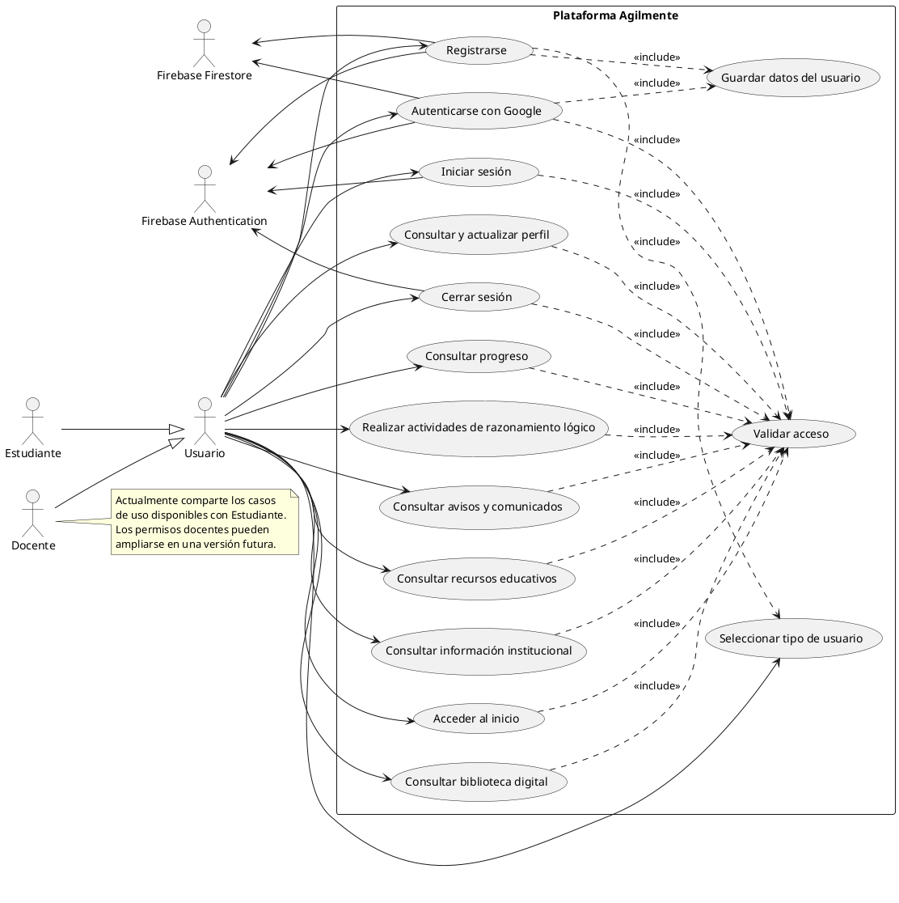

# Diagrama de casos de uso

## Sistema Agilmente

## Actores

| Actor | Descripción |
| --- | --- |
| Usuario | Actor general que representa a cualquier persona que utiliza la plataforma. |
| Estudiante | Usuario que consulta contenidos, actividades, avisos y su progreso. |
| Docente | Tipo de usuario contemplado por el registro; actualmente utiliza las funciones comunes implementadas. |
| Firebase Authentication | Servicio externo que gestiona autenticación por correo, contraseña y Google. |
| Firebase Firestore | Servicio externo que almacena los datos del usuario. |

## Casos principales

| Caso de uso | Resultado esperado |
| --- | --- |
| Registrarse | Crea la cuenta, guarda el perfil y dirige al inicio. |
| Iniciar sesión | Valida las credenciales y permite acceder al área protegida. |
| Autenticarse con Google | Inicia sesión con Google y crea o actualiza el perfil. |
| Consultar contenidos | Permite acceder a biblioteca, recursos, avisos e información institucional. |
| Consultar progreso | Muestra los logros y avances del usuario. |
| Realizar actividades | Permite acceder a los retos de razonamiento lógico disponibles. |
| Consultar y actualizar perfil | Permite revisar los datos y ajustes de la cuenta. |
| Cerrar sesión | Finaliza la sesión y devuelve al formulario de acceso. |

> Nota: el diagrama refleja las funcionalidades visibles en las rutas y componentes actuales. La administración de cursos, calificaciones o contenidos por parte del docente no se incluye porque todavía no está implementada.
